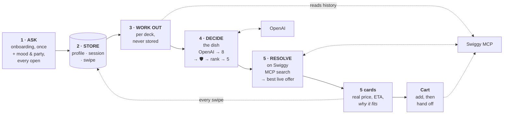

<h1 align="center">Kya Khaoon 🍽️</h1>

<p align="center">
  <b><i>What should I eat today?</i></b><br/>
  A phone-first app that answers the question for you — two quick screens,<br/>
  then five AI-picked dishes resolved live on Swiggy.<br/>
  Swipe right to add to your cart, left to skip.
</p>

<p align="center">
  <a href="https://github.com/TestZucky/Kya-Khaoon/actions/workflows/backend-tests.yml"></a>
  <a href="LICENSE"></a>
  
  
  
  
  
</p>

---

## Why

Food apps are catalogues. They hand you a thousand options and a search bar, and
the decision — the actual work — stays yours. Most people don't want to browse;
they want to eat.

Kya Khaoon inverts that. It knows your diet, allergies, budget, spice tolerance
and what you ate this week, asks the two things that change meal to meal, and
returns **five dishes**. No feed, no infinite scroll, no filters to tune. You
swipe five times and you're done.

It deliberately stops at the cart. Kya Khaoon owns the *decision*; Swiggy owns
the transaction. There is no order-placement endpoint in this codebase — the
hand-off is a checkout link, and payment happens where it always did.

## How it works

React on the front, FastAPI behind it, one OpenAI call and one Swiggy MCP server
either side. The interesting part isn't the boxes — it's what flows between them.



**It works in two stages, and the split is the point.** Swiggy can tell you a
dish's price, delivery time and whether it's in stock. It cannot tell you what's
in it, what you're allergic to, or how heavy it'll sit — which is exactly what
deciding requires. So stage 1 picks dish *ideas* against your taste, and stage 2
turns each idea into something you can actually order.

### 1 · What we ask

Deliberately little, across two screens split by consequence.

| When | What we ask | Why there |
|---|---|---|
| **First screen** | Diet, allergies | The only answers where being wrong means serving food you can't eat |
| **Second screen** | Budget, favourite cuisines, spice tolerance | These tilt the ranking — they never rule a dish out |
| **Later, optional** | Goal, height and weight, home state | Sharpen the picks; never block your first deck |
| **Every time you open** | Mood, how many people | Genuinely change meal to meal, so they're never stored as truth |
| **Never asked** | Which meal you're in | Read from your phone's clock |

Three answers get translated on the way in: a multi-select diet collapses to its
most restrictive choice, a budget number becomes a band, and party size becomes
both a word the model understands and the quantity added to your cart — a table
of three orders three portions.

### 2 · Where it lives

Everything is filed by **how long it stays true**. That's what lets "something
light tonight" shape one deck without ever overwriting "I'm vegetarian".

| What | Lives for | Holds |
|---|---|---|
| **Account** | forever | who you are, your chosen Swiggy address, your Swiggy tokens |
| **Profile** | until you change it | diet, allergies, budget, cuisines, spice, goal, body metrics |
| **This meal** | one deck | mood, party size, meal period, any one-off budget |
| **Swipes** | history | every left and right, with the reason — the only thing that learns |
| **Dish vocabulary** | grows | every dish the model has ever proposed, kept for next time |
| **The deck** | one deck | the listings actually shown, exactly as they were |

### 3 · What we work out

None of this is asked for, and none of it is stored. It's recalculated from
scratch on every request — which is what stops a stale answer from quietly
poisoning your picks months later.

| We work out | From | So that |
|---|---|---|
| Whether to search veg-only | your diet | Swiggy never returns something you can't eat |
| What you can spend | tonight's budget, else your usual | nothing over it ranks well |
| How heavy the meal should be | your mood | "light" and "comfort" mean different dishes |
| Roughly how you're built | height and weight | picks tilt gently — never restrict |
| What you've seen lately | your last three days of swipes | the same cuisine doesn't come back twice |
| What you actually order | your Swiggy history | it echoes what you love and skips last night's dinner |

### 4 · Deciding the dish

Your profile and everything above go to the model as one short brief — with
spice as a word rather than a number, because "mild" reads better than `0`.

It comes back with **eight dishes, not five**, each described honestly enough to
be ranked: what's in it, how heavy, how spicy, what it usually costs, which meals
it suits. Then two things happen that the model gets no vote in.

1. **Anything unsafe is dropped.** Not scored low — removed. Wrong for your diet,
   or carrying something you're allergic to, and it's gone before ranking starts.
   Checked more than once, because models hallucinate and an allergy is not a
   maybe.
2. **The rest are re-ranked to five** by plain, readable rules: budget, mood, the
   meal you're in, your heat tolerance, what you've eaten lately, your goal. The
   model's own one-line *why* is kept as the card's reason — only the order is
   ours.

The model knows what food *is*; the rules are what apply **your** constraints the
same way every single time. Asking one model to do both at once is where it
quietly slips — so it proposes, and the rules dispose.

With no `OPENAI_API_KEY` the same rules run the whole stage over a starter
catalogue, and the app works unchanged.

### 5 · Resolving on Swiggy

All five ideas are looked up on Swiggy at once. Swiggy is a remote **OAuth MCP
server**, so the backend forwards each user's own token per call.

| What we call | For |
|---|---|
| `get_addresses` | the delivery address every other call is scoped to |
| `get_food_orders` | your past orders, read before we pick anything |
| `search_menu` | live listings — price, photo, whether it's in stock |
| `search_restaurants` | delivery time, rating, open or closed, and the `(Ad)` flag |
| `update_food_cart` | a swipe right |
| `get_food_cart` | the real total, read straight back from Swiggy |

Out of stock, closed, or a side dish that merely matched the word? Dropped. What
survives is scored on rating, fitting your budget, and how fast it arrives — then
**penalised for being a sponsored placement**, so an ad can never win on
placement alone.

**An idea with nothing actually available is dropped, not faked** — which is why
a deck can honestly come back with fewer than five cards.

Swiping right builds your cart and hands you a checkout link. It does not place
the order: there is no order-placement endpoint here, and a test asserts we never
call one.

## Local development

Requires Docker and `make`. Nothing else — no Python, Node or Postgres on your
machine, and no venv to keep in sync.

```bash
cp .env.example .env     # add OPENAI_API_KEY for AI picks; works without one
make dev                 # everything → http://localhost:5173
```

That's it. The first run builds the images (a minute or so); after that it's a
few seconds.

- **Postgres is the only supported database.** It runs as the `db` service, and
  the backend applies migrations on boot.
- **Swiggy is faked by default** — canned menus, prices and photos, no account
  and no network — so the full flow runs offline. Tap *Connect Swiggy* in the app
  to switch a user to the real thing.
- **Your working copy is bind-mounted**, so editing a `.py` reloads uvicorn and
  editing a `.tsx` triggers Vite HMR, exactly as it would natively. You only need
  `make build` when `requirements.txt` or `package.json` changes.

### Commands

Run `make` on its own to list these at any time.

| Command | Does |
|---|---|
| `make dev` | run db + backend + frontend (Ctrl+C stops them) — alias for `make up` |
| `make build` | rebuild the images, after a `requirements.txt` / `package.json` change |
| `make logs` | follow logs from all services |
| `make backend` / `make frontend` | follow just one service's logs |
| `make test` | the backend suite in a container, against a throwaway Postgres |
| `make migrate` | bring the database up to the latest schema |
| `make revision m="..."` | autogenerate a migration from the models |
| `make seed` | *optional* — starter dishes for the no-LLM fallback |
| `make psql` | a psql shell on the dev database |
| `make wipe` | destroy the database volume and rebuild from migrations (alias: `make reset`) |
| `make sh` | a shell inside the backend container |
| `make down` | stop everything, keeping your data (alias: `make stop`) |
| `make clean` | remove containers, volumes and the frontend build |

API docs are at `http://localhost:8000/docs` once the backend is up. CI runs
`make test` on the same image you use locally, so it can't drift from your
machine.

## License

[MIT](LICENSE).
