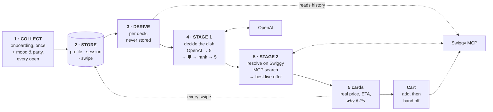

# Kya Khaoon 🍽️

**_What should I eat today?_** — a phone-first app that answers the question for
you. Two quick screens, then five AI-picked dishes resolved live on Swiggy:
swipe right to add to your cart, left to skip.

---

## Why

Food apps are catalogues. They hand you a thousand options and a search bar, and
the decision — the actual work — stays yours. Most people don't want to browse;
they want to eat.

Kya Khaoon inverts that. It knows your diet, allergies, budget, spice tolerance
and what you ate this week, asks two things that change meal to meal (mood, how
many people), and returns **five dishes**. No feed, no infinite scroll, no
filters to tune. You swipe five times and you're done.

It deliberately stops at the cart. Kya Khaoon owns the *decision*; Swiggy owns
the transaction. There is no order-placement endpoint in this codebase — the
hand-off is a checkout link, and payment happens where it always did.

## Architecture

React on the front, FastAPI behind it, one OpenAI call and one Swiggy MCP server
either side. The interesting part isn't the boxes — it's what flows between them.



**Two stages, and the split is the point.** Swiggy can tell you a dish's price,
ETA and stock. It cannot tell you its ingredients, allergens or how heavy it is —
which is exactly what deciding requires. So stage 1 picks dish *ideas* against a
taste profile, and stage 2 turns each idea into a real, orderable listing.

### 1 · What we collect

Deliberately little. Two onboarding screens, split by consequence: screen 1 asks
the two answers that are *hard filters*, screen 2 asks what merely tilts ranking.

| When | Asked | Why it's asked there |
|---|---|---|
| Onboarding, screen 1 | `diet`, `allergies` | The only answers where being wrong means serving food someone can't eat |
| Onboarding, screen 2 | `budget`, `cuisines`, `spice_level` | Tilt the ranking, never exclude |
| Profile, optional | `goal`, `height_cm`, `weight_kg`, `home_state` | Sharpen picks; never block a first deck |
| Every open | `mood`, party size | Genuinely change meal to meal, so they're never stored as truth |
| Nobody asks | meal period | Read from the device clock |

Three answers are translated on the way in (`lib/mapPrefs.ts`): multi-select diet
collapses to the most restrictive single value, a budget number becomes a band,
and party size becomes both a `companions` label for the prompt and the cart
quantity — a table of three adds three portions.

### 2 · Where it's stored

State is split by **lifetime**, so "something light tonight" can refine one deck
without ever overwriting "I am vegetarian".

| Table | Lifetime | Holds |
|---|---|---|
| `user` | forever | identity (`device_id` / `phone` / `google_sub`), chosen Swiggy address, Swiggy OAuth tokens |
| `profile` | permanent | diet, allergies, budget band, cuisines, spice, goal, body metrics, home state |
| `session` | one deck | mood, party, meal period, any per-meal budget override |
| `swipe` | history | every left/right + rejection reason — the learning signal |
| `dishconcept` | grows | the dish vocabulary, upserted from whatever the model generates |
| `offer` · `deck` · `deck_card` | one deck | the resolved listings actually shown |

### 3 · What we derive

None of this is stored or asked for. It's recomputed on every deck request, which
is what keeps a stale field from quietly poisoning future picks.

| Derived | From | Feeds |
|---|---|---|
| `veg_only` | `diet ∈ {veg, vegan, jain}` | Swiggy's `vegFilter` **and** the hard filter |
| `budget_ceiling` | session override, else the band | scoring, and stage-2 ranking |
| target heaviness | `mood` (comfort → 5, light → 1) | scoring |
| BMI + category | `height_cm`, `weight_kg` | a nudge in the prompt and in scoring — never a restriction |
| recent cuisines · styles · dish ids | swipes, last 3 days | the variety penalty |
| just-ordered dishes, usual spend | Swiggy `get_food_orders` | the prompt, so the deck doesn't echo Tuesday's dinner |

### 4 · Stage 1 — deciding the dish

The prompt is assembled from the profile plus the derived values above:

```
Diet · Allergies (NEVER suggest) · Avoid · Favourite cuisines · Goal
Spice tolerance (as words — "mild", not 0) · Budget: up to ₹N · Meal right now
Home region · BMI · Mood · Eating with · Order history · Ate/saw recently
```

OpenAI returns **8 candidates, not 5**, under a strict JSON schema — each one
carrying `name`, `search_query`, `cuisine`, `is_veg`, `contains[]`, `why`,
`combo`, `ingredients[]`, `cooking_style`, `heaviness`, `spice_level`,
`typical_price`, `typical_calories` and `meals[]`.

Those last seven exist so the deterministic scorer has something to rank on.
Numbers are **clamped, not trusted** — a returned `heaviness: 99` becomes 5
rather than skewing every comparison it touches.

Then two things happen that the model does not get a vote in:

1. **Safety filter.** Anything veg-required-but-not-veg, or whose `contains[]`
   intersects the declared allergies, is *dropped* — never scored low, dropped.
   Survivors are re-checked against the profile a second time after upsert.
2. **Re-rank to five.** The scorer applies budget, mood, meal time, spice
   tolerance, variety penalty, goal and BMI. The model's `why` is kept as the
   card's reason; only the *ordering* comes from scoring.

The model knows what food *is*; the scorer is what consistently applies this
user's constraints. Asking one model to do both in a single shot is where it
quietly slips — so it proposes, and the rules dispose. With no `OPENAI_API_KEY`,
the same scorer runs the whole stage over the seeded catalogue and the app works
unchanged.

### 5 · Stage 2 — resolving on Swiggy

Each of the five concepts is resolved against Swiggy in parallel. Swiggy is a
remote **OAuth MCP server**, so the backend speaks JSON-RPC 2.0 over Streamable
HTTP and forwards each user's own bearer token per call.

| MCP tool | Used for |
|---|---|
| `get_addresses` | the delivery address every other call is scoped to |
| `get_food_orders` | order history → taste patterns, before picking |
| `search_menu` | `addressId`, `query`, `vegFilter` → live listings, price, photo, stock |
| `search_restaurants` | ETA, rating, open status, and the `(Ad)` flag |
| `update_food_cart` | swipe right |
| `get_food_cart` | the real payable total, read straight back |

Ranking a concept's search hits: drop out-of-stock items, side dishes and combos
that matched the word but aren't the meal, and restaurants that reported
themselves closed. Score what's left on rating, staying within budget and ETA —
then subtract 4 if it's an `(Ad)` placement, so a sponsored slot can never win on
placement alone. **A concept with no open offer is dropped, not faked**, which is
why a deck can come back with fewer than five cards.

`/cart` calls `update_food_cart` and returns a checkout URL. It does not place
the order — there is no order-placement endpoint in this codebase, and a test
asserts the MCP path never calls `place_food_order` or `confirm_order`.

## Local development

Requires Docker and `make`. Nothing else — no Python, Node or Postgres on your
machine, and no venv to keep in sync.

```bash
cp .env.example .env     # add OPENAI_API_KEY for AI picks; works without one
make dev                 # everything → http://localhost:5173
```

That's it. The first run builds the images (a minute or so); after that it's a
few seconds. **Postgres is the only supported database** — it runs as the `db`
service, and the backend applies migrations on boot. The default config uses a
**fake Swiggy client** — canned menus, prices and photos, no account and no
network — so the full flow runs offline. Tap *Connect Swiggy* in the app to
switch a user to the real thing.

Your working copy is bind-mounted into the containers, so editing a `.py`
reloads uvicorn and editing a `.tsx` triggers Vite HMR, exactly as it would
natively. You only need `make build` when `requirements.txt` or `package.json`
changes.

| Command | Does |
|---|---|
| `make dev` | run db + backend + frontend (Ctrl+C stops them) |
| `make backend` / `make frontend` | follow one service's logs |
| `make test` | backend suite in a container, against a throwaway Postgres |
| `make migrate` | bring the database up to the latest schema |
| `make revision m="..."` | autogenerate a migration from the models |
| `make psql` | psql shell on the dev database |
| `make wipe` | destroy the database volume and rebuild from migrations |
| `make seed` | *optional* — starter dishes for the no-LLM fallback |
| `make sh` | shell into the backend container |
| `make down` | stop everything (keeps your data) |
| `make clean` | remove containers, volumes and the frontend build |

API docs are at `http://localhost:8000/docs` once the backend is up.

## License

[MIT](LICENSE).
